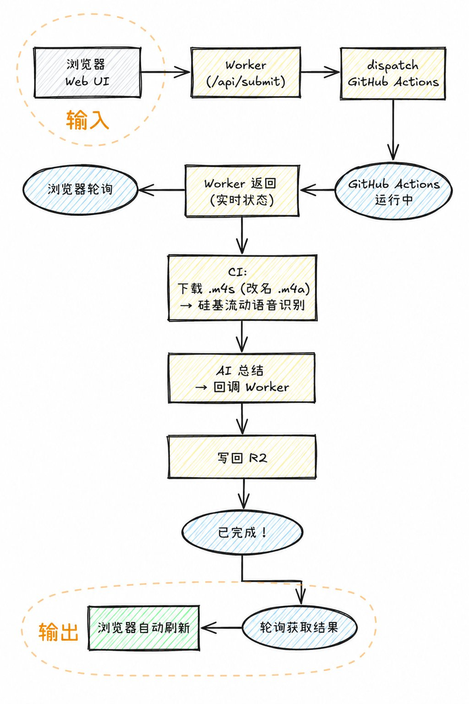
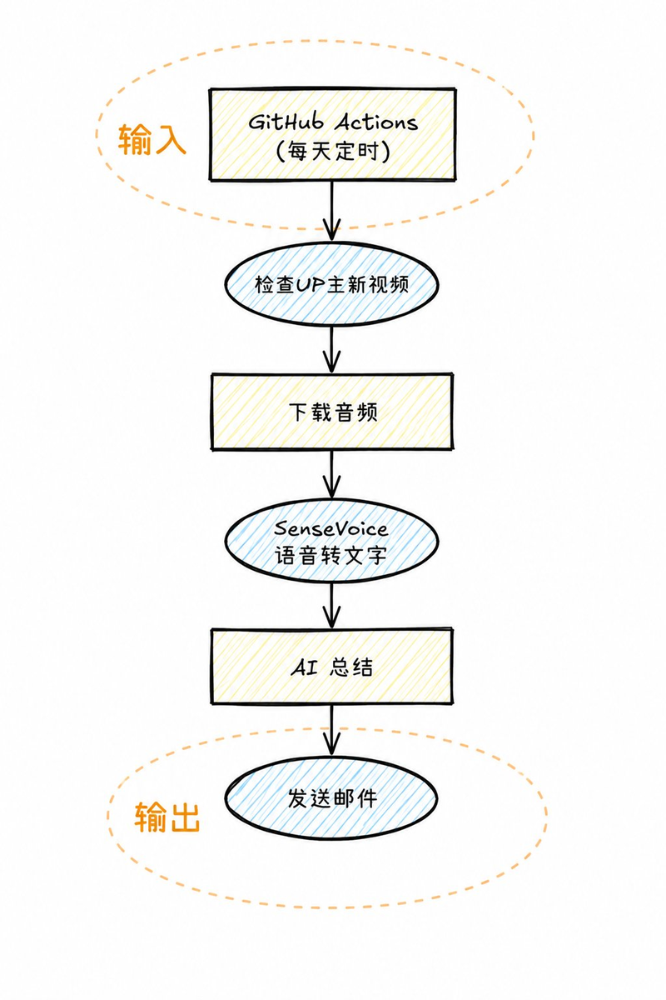

# 🎬 Bilibili AI Summary - B站视频 AI 摘要 & 邮件推送

📋 **概述**

自动监控指定B站UP主的新视频 → 下载音频 → 语音转录 → AI总结 → 发送邮件通知。
支持 **Web UI 手动提交**（实时轮询进度、跨设备历史同步）和 **定时自动监控** 两种模式。

💰 **全程免费** | 🔄 **全自动** | ☁️ **零服务器** | 🔌 **一键部署**

---

## 💸 费用清单

| 项目 | 方案 | 费用 |
|------|------|------|
| 📡 B站 API | 公开接口 | 免费 |
| 🎙️ 语音识别 | 硅基流动 SenseVoiceSmall | 完全免费 |
| 🤖 AI 总结 | 硅基流动 Qwen/Qwen3-8B | 完全免费 |
| 🕐 定时运行 | GitHub Actions (2000分钟/月) | 免费 |
| 📧 邮件发送 | QQ邮箱 SMTP | 免费 |
| **总计** | **一个 API Key 搞定全部** | **完全免费 🏆** |

---

## 🔄 工作流程

<div align="center">
  <table>
    <tr>
      <td align="center"><b>手动提交模式（Web UI）</b></td>
      <td align="center"><b>定时监控模式</b></td>
    </tr>
    <tr>
      <td></td>
      <td></td>
    </tr>
  </table>
</div>

> **关键优化**: .m4s 本身是 AAC 音频容器，直接改名 .m4a 上传，**无需 ffmpeg 转码**。
> 依赖仅 2 个 pip 包 (requests + openai)，安装只需 12 秒。

---

## 🚀 一键部署

[](https://deploy.workers.cloudflare.com/?url=https://github.com/shiranzby/bilibili-ai-summary)

> 点击上方按钮直接 Fork 仓库并部署到你自己的 Cloudflare Workers 账号。
> 也可以手动部署：

```bash
git clone https://github.com/shiranzby/bilibili-ai-summary.git
cd bilibili-ai-summary/cloudflare
# 配置 wrangler.toml 中的 account_id 和 R2 bucket 名
npx wrangler deploy
```

---

### 第1步: 获取 API Key

**只需一个 Key：硅基流动 (SiliconFlow)**

一个 Key 同时搞定语音识别和 AI 总结，完全免费，无需额外注册。

1. 打开 https://cloud.siliconflow.cn/ 注册
2. 创建 API Key 并复制

### 第2步: 配置 GitHub Secrets

| Secret 名称 | 说明 | 必填 |
|-------------|------|------|
| `SILICONFLOW_API_KEY` | 硅基流动 Key (语音识别 + AI总结) | ✅ |
| `SMTP_USER` | 发件邮箱 (如 `123456@qq.com`) | ✅ |
| `SMTP_PASS` | QQ邮箱SMTP授权码 (16位字母) | ✅ |
| `SMTP_TO` | 收件邮箱 | ✅ |
| `SILICONFLOW_STT_MODEL` | 语音转文字模型 (默认 FunAudioLLM/SenseVoiceSmall) | 可选 |
| `SILICONFLOW_SUMMARY_MODEL` | AI总结模型 (默认 Qwen/Qwen3-8B) | 可选 |

### 第3步: 部署 Cloudflare Worker

需要 Cloudflare 账号 + R2 Bucket（用于存储任务数据和跨设备历史记录同步）。

Worker 环境变量需设置:
- `GH_TOKEN`: GitHub Personal Access Token（用于 dispatch Actions）
- `GH_OWNER`: GitHub 用户名（默认 shiranzby）
- `GH_REPO`: GitHub 仓库名（默认 bilibili-ai-summary）

### 第4步: 修改配置

编辑 `bilibili_summary/config.py`：

```python
UP_MIDS = [12345678, 23456789]  # UP主UID列表
```

UP主UID获取：打开UP主主页，URL末尾的数字。

#### 配置定时监控时间

编辑 `.github/workflows/summary.yml` 中的 cron 表达式：

```yaml
on:
  schedule:
    # UTC 时间，北京时间 = UTC + 8
    # 每天 08:00 和 20:00 (北京时间 16:00 和 04:00)
    - cron: '0 0 * * *'
    - cron: '0 8 * * *'
    - cron: '0 16 * * *'
```

`cron` 格式为 `分钟 小时 日 月 星期`，使用 UTC 时间。示例：

| 北京时间 | UTC 时间 | cron 表达式 |
|---------|---------|------------|
| 每天 08:00 | 0:00 | `0 0 * * *` |
| 每天 12:00 | 4:00 | `0 4 * * *` |
| 每天 16:00 | 8:00 | `0 8 * * *` |
| 每天 20:00 | 12:00 | `0 12 * * *` |
| 每天 08:00 + 20:00 | 0:00 + 12:00 | `0 0,12 * * *` |

可以写多个 `- cron:` 行来实现一天多次监控，例如 `[0 0,6,12,18 * * *]` 表示每 6 小时一次。

### 第5步: 完成！

- **手动测试**: 打开 Worker URL → 输入BV号 → 点击「开始处理」
- **自动监控**: 按配置的 cron 时间自动运行

---

## 🌐 Web UI 功能

部署 Worker 后访问其 URL 即可打开 Web UI：

- 🚀 输入BV/av号或直接粘贴链接（含标题），系统自动提取
- 📊 **实时进度** — 轮询 GitHub Actions 运行状态，显示 6 步进度箭头流程图
- 📝 **转录文本** — 手风琴展开查看，支持 TXT / MD 下载和复制
- 🤖 **AI 总结** — 支持 TXT / MD 下载和复制
- 🎨 **排版布局** — 垂直 / 水平（可拖拽分列）双模式切换
- 🔍 **历史搜索** — 按标题、BV号、UP主名、日期搜索
- 🔄 **跨设备同步** — 历史记录通过 R2 同步，多设备共享
- 🗑 **批量管理** — 全选/反选/批量删除
- 🌓 **深色模式** — 切换深色/浅色主题
- 📐 **拖拽分隔** — Sidebar 宽度可自由拖拽调整
- 📋 **粘贴板支持** — 一键粘贴 B站链接（自动提取 av/BV 号）

---

## 📁 项目结构

```
bilibili-ai-summary/
├── images/
│   ├── workflow1.png          # 手动提交工作流示意图
│   └── workflow2.png          # 定时监控工作流示意图
├── PROJECT_MEMORY.md          # 🧠 项目长期记忆（架构/设计/踩坑记录）
├── SOUL.md                    # 🔥 AI 工作经验（输出规范/常见失误/技术模式）
├── LESSONS_LEARNED.md         # 📖 经验教训库（每次问题的根因与解决）
├── bilibili_summary/
│   ├── config.py              # 🔑 配置文件
│   ├── bili_api.py            # B站API封装
│   ├── audio_transcriber.py   # 音频下载 (playurl CDN) + 语音识别
│   ├── summarizer.py          # AI总结 (硅基流动)
│   ├── emailer.py             # 邮件发送
│   ├── monitor.py             # 每日监控主流程
│   ├── process_single.py      # 单条视频处理 (Web UI 触发)
│   ├── callback_worker.py     # CI 回调 Worker (写回 R2)
│   ├── send_result_email.py   # 单条结果邮件发送
│   ├── inject_config.py       # Secrets 注入
│   └── requirements.txt       # 仅 requests + openai
├── cloudflare/
│   ├── worker.js              # Worker (API + 前端UI内嵌)
│   └── wrangler.toml          # Worker 部署配置
├── .github/workflows/
│   └── summary.yml            # GitHub Actions 工作流
└── README.md
```

---

## ❓ 常见问题

**Q: 需要多个 API Key 吗？**
A: 不需要。一个 **硅基流动 API Key** 同时覆盖语音识别和 AI 总结。

**Q: 需要 ffmpeg 吗？**
A: **不需要。** .m4s 本身就是 AAC 音频容器，直接改名 .m4a 上传即可。

**Q: 视频没有字幕怎么办？**
A: 我们的方案不依赖B站字幕。自动下载音频 → 硅基流动语音识别 → 转文字。

**Q: 需要B站Cookie吗？**
A: 不需要。全部通过B站公开API + 音频CDN下载。

**Q: 整个链路跑完要多久？**
A: 约 **3-6 分钟**：下载音频 (~30秒) → 语音识别 (~2-4分钟) → AI 总结 (~30秒) → 回调汇总 (~5秒)

**Q: 不同设备的历史记录同步吗？**
A: 是的。通过 Cloudflare R2 存储，多设备共用同一 Worker 时历史记录自动同步。

**Q: 支持从链接自动提取视频号吗？**
A: 支持。粘贴含标题的完整 URL（如 `【标题-哔哩哔哩】 https://www.bilibili.com/video/BVxxx`），系统会自动提取 BV 或 av 号。
