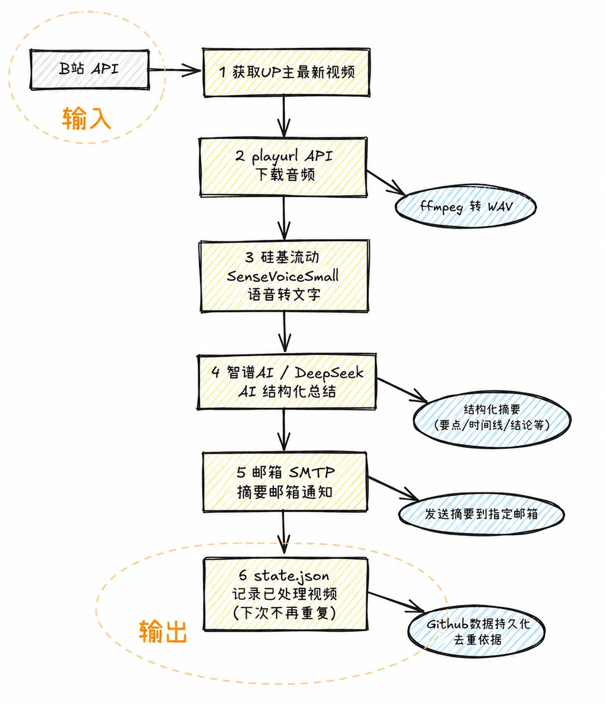

# 🎬 Bilibili AI Summary - B站UP主视频 AI 摘要 & 邮件推送

📋 **概述**

自动监控指定B站UP主的新视频 → 下载音频 → 语音转录 → AI总结 → 发送邮件通知。

💰 **全程免费** | 🔄 **全自动** | ☁️ **零服务器** | 🔌 **一键部署**

---

## 💸 费用清单

| 项目 | 方案 | 费用 |
|------|------|------|
| 📡 B站 API | 公开接口 | 免费 |
| 🎙️ 语音识别 | 硅基流动 SenseVoiceSmall | 完全免费 |
| 🤖 AI 总结 | 硅基流动 Qwen/Qwen3-8B | 完全免费 |
| 🕐 定时运行 | GitHub Actions (2000分钟/月) | 免费 |
| 📧 邮件发送 | QQ邮箱 SMTP | 免费 |
| **总计** | **一个 API Key 搞定全部** | **完全免费 🏆** |

---

## 🔄 工作流程

<p align="center">
  
</p>

> **注**：无需B站Cookie，无需AI字幕，纯音频转录+AI总结，任何视频都能处理。

---

## 🚀 一键部署 (GitHub Actions)

### 第1步: 推送代码到 GitHub

```bash
git clone https://github.com/shiranzby/bilibili-ai-summary.git
cd bilibili-ai-summary
# 修改配置后推送
git add .
git commit -m "init"
git push
```

### 第2步: 获取 API Key

**只需一个 Key：硅基流动 (SiliconFlow)**

一个 Key 同时搞定语音识别和 AI 总结，完全免费，无需额外注册。

1. 打开 https://cloud.siliconflow.cn/ 注册
2. 创建 API Key 并复制

> 系统其他 AI 后端（智谱AI、DeepSeek、Gemini）也支持，如需切换在 `config.py` 中修改 `AI_BACKEND` 并添加对应 Secret 即可。默认无需额外配置。

### 第3步: 配置 GitHub Secrets

在仓库 **Settings → Secrets and variables → Actions** 添加：

| Secret 名称 | 说明 | 必填 |
|-------------|------|------|
| `SILICONFLOW_API_KEY` | 硅基流动 Key (语音识别 + AI总结) | ✅ |
| `ZHIPU_API_KEY` | 智谱AI Key (需切换后端) | 可选 |
| `DEEPSEEK_API_KEY` | DeepSeek Key (需切换后端) | 可选 |
| `SMTP_USER` | 发件邮箱 (如 `123456@qq.com`) | ✅ |
| `SMTP_PASS` | QQ邮箱SMTP授权码 (16位字母) | ✅ |
| `SMTP_TO` | 收件邮箱 | ✅ |
| `SILICONFLOW_MODEL` | 硅基流动总结模型 (默认 Qwen/Qwen3-8B) | 可选 |

### 第4步: 修改配置

编辑 `bilibili_summary/config.py`：

```python
# 改UP主UID
UP_MIDS = [
    12345678,      # 可填单个
    23456789,      # 也可填多个
]

# AI后端 (默认 siliconflow，一个 Key 搞定所有)
AI_BACKEND = "siliconflow"        # 默认 (推荐)
# AI_BACKEND = "zhipu"           # 智谱AI
# AI_BACKEND = "deepseek"        # DeepSeek
# AI_BACKEND = "gemini"          # Google Gemini

# 硅基流动总结模型 (可在 https://cloud.siliconflow.cn/ 查看免费模型)
SILICONFLOW_MODEL = "Qwen/Qwen3-8B"
```

UP主UID获取：打开UP主主页，URL末尾的数字。如 `space.bilibili.com/12345678` → `12345678`。

### 第5步: 完成！

手动触发测试：GitHub仓库 → **Actions** → **B站AI摘要** → **Run workflow**

以后每天 **08:00** 和 **20:00** 自动运行，邮件通知自动送达。📧

---

## 📧 邮件效果

精美 HTML 排版，包含：

- 🎬 **标题栏** — UP主 + 视频数量
- 📺 **视频卡片** — 标题、时长、发布时间
- 🤖 **AI 总结** — 核心主题 + 要点提炼 + 总结
- 🔗 **观看链接** — 一键直达B站视频

---

## ❓ 常见问题

**Q: 需要多个 API Key 吗？**
A: 不需要。一个 **硅基流动 API Key** 同时覆盖语音识别和 AI 总结，完全免费。其他后端（智谱AI、DeepSeek、Gemini）作为可选保留，默认不用。

**Q: 视频没有字幕怎么办？**
A: 我们的方案不依赖B站字幕。**自动下载音频 → 硅基流动语音识别 → 转文字**，任何视频都能处理。

**Q: 需要B站Cookie吗？**
A: 不需要。完全通过B站公开API + 音频CDN下载，无需登录。

**Q: 可以只监控一个UP主吗？**
A: 可以。`UP_MIDS = [12345678]` 只填一个就行。也可以监控多个，用逗号分隔。

---

## 📁 项目结构

```
bilibili_summary/
├── config.py              # 🔑 配置文件 (改UP主、AI后端在这里)
├── bili_api.py            # B站API封装
├── audio_transcriber.py   # 音频下载 + 语音识别 (硅基流动)
├── summarizer.py          # AI总结 (默认硅基流动 Qwen3-8B，支持多后端)
├── emailer.py             # 邮件发送 (HTML模板)
├── monitor.py             # 主流程脚本
├── inject_config.py       # Secrets注入工具
├── requirements.txt       # Python依赖
├── state.json             # 已处理视频记录
└── .github/workflows/
    └── summary.yml        # GitHub Actions 工作流
```
